# Modelo do banco de dados (DER)

Banco: **MySQL 8.4** (InnoDB, utf8mb4). Scripts em [`src/main/resources/sql`](../../src/main/resources/sql).
Instalação no Windows: [`instalar-mysql.md`](instalar-mysql.md).

O diagrama abaixo é renderizado automaticamente pelo GitHub.

```mermaid
erDiagram
    usuario {
        int id PK
        varchar nome
        varchar login UK
        varchar senha_hash
        varchar perfil
        boolean ativo
    }

    membro {
        int id PK
        varchar nome
        varchar matricula UK
        varchar contato
        varchar situacao
    }

    atleta {
        int id PK
        varchar nome
        varchar matricula UK
        varchar contato
        date data_nascimento
        varchar situacao
    }

    modalidade {
        int id PK
        varchar nome
        varchar genero
    }

    atleta_modalidade {
        int atleta_id PK, FK
        int modalidade_id PK, FK
        varchar situacao
    }

    gestao {
        int id PK
        varchar nome UK
        date data_inicio
        date data_fim
        varchar situacao
    }

    cargo {
        int id PK
        varchar nome UK
        int ordem
        int cargo_superior_id FK
    }

    gestao_membro_cargo {
        int gestao_id PK, FK
        int membro_id PK, FK
        int cargo_id PK, FK
    }

    treino {
        int id PK
        varchar tipo "TREINO ou AMISTOSO"
        date data
        time horario
        int modalidade_id FK
        int responsavel_id FK
        varchar adversario
        varchar resultado
    }

    presenca_treino {
        int treino_id PK, FK
        int atleta_id PK, FK
        boolean presente
    }

    competicao {
        int id PK
        varchar titulo
        date data
        date data_fim
        varchar situacao
    }

    competicao_modalidade {
        int competicao_id PK, FK
        int modalidade_id PK, FK
    }

    competicao_atleta {
        int competicao_id PK, FK
        int modalidade_id PK, FK
        int atleta_id PK, FK
    }

    resultado {
        int id PK
        int competicao_id FK
        int modalidade_id FK
        int atleta_id FK "nulo = equipe"
        int colocacao
        varchar placar
    }

    evento {
        int id PK
        varchar titulo
        varchar tipo_evento
        date data
        varchar situacao
    }

    evento_responsavel {
        int evento_id PK, FK
        int membro_id PK, FK
    }

    tarefa {
        int id PK
        int evento_id FK
        int competicao_id FK
        varchar descricao
        int responsavel_id FK
        date prazo
        varchar situacao
    }

    compromisso {
        int id PK
        varchar titulo
        date data
        time horario
    }

    pasta {
        int id PK
        varchar nome UK
        timestamp criada_em
    }

    arquivo {
        int id PK
        int pasta_id FK
        varchar nome
        varchar caminho UK "relativo à pasta de mídias"
        varchar tipo "IMAGEM ou VIDEO"
        bigint tamanho
        timestamp enviado_em
        varchar enviado_por
    }

    atleta ||--o{ atleta_modalidade : pratica
    modalidade ||--o{ atleta_modalidade : tem
    gestao ||--o{ gestao_membro_cargo : compoe
    membro ||--o{ gestao_membro_cargo : ocupa
    cargo ||--o{ gestao_membro_cargo : "é ocupado"
    cargo |o--o{ cargo : "subordinado a"
    modalidade ||--o{ treino : tem
    membro |o--o{ treino : "responsável"
    treino ||--o{ presenca_treino : registra
    atleta ||--o{ presenca_treino : comparece
    competicao ||--o{ competicao_modalidade : inscreve
    modalidade ||--o{ competicao_modalidade : disputada
    competicao_modalidade ||--o{ competicao_atleta : participa
    atleta ||--o{ competicao_atleta : inscrito
    competicao_modalidade ||--o{ resultado : obtem
    atleta |o--o{ resultado : conquista
    evento ||--o{ evento_responsavel : organiza
    membro ||--o{ evento_responsavel : responsavel
    evento |o--o{ tarefa : possui
    competicao |o--o{ tarefa : possui
    membro |o--o{ tarefa : executa
    pasta ||--o{ arquivo : contem
```

## Regras de integridade (RN15, RN16)

| Situação | Regra |
|---|---|
| Excluir modalidade com atletas, treinos ou competições | **Bloqueado** (RESTRICT) |
| Excluir membro que ocupa cargo, é responsável por evento ou tarefa | **Bloqueado** |
| Excluir atleta com presença ou inscrição em competição | **Bloqueado** |
| Excluir atleta | Apaga junto seus vínculos com modalidades |
| Excluir treino | Apaga junto as presenças |
| Excluir competição | Apaga junto modalidades inscritas, atletas e resultados |
| Excluir evento | Apaga junto responsáveis e tarefas |
| Excluir gestão | Apaga junto a composição (membro x cargo) |
| Excluir cargo superior | O cargo subordinado fica sem superior |
| Excluir pasta com arquivos | **Bloqueado**: o sistema pede para excluir os arquivos antes |

O sistema deve pedir confirmação antes de qualquer exclusão em cascata (CH-45).

## Herança no banco

As classes Java `Treino` e `Amistoso` ficam na mesma tabela `treino`, diferenciadas pela coluna `tipo`.
`Membro`, `Atleta` e `Usuario` (subclasses de `Pessoa`) têm uma tabela cada.
