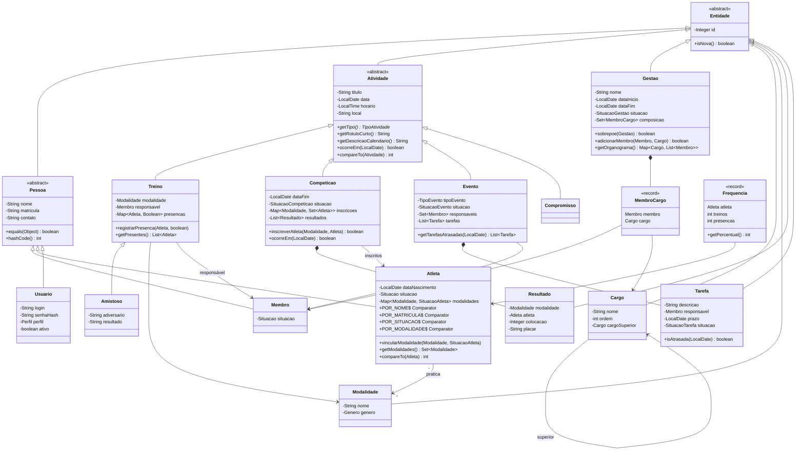
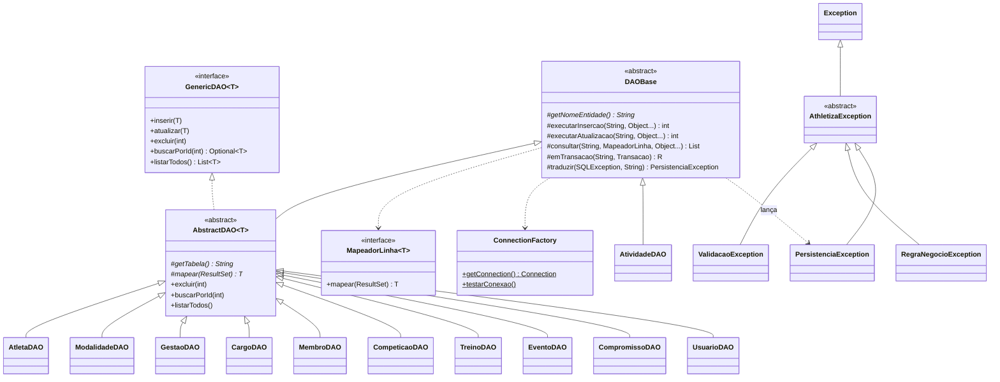
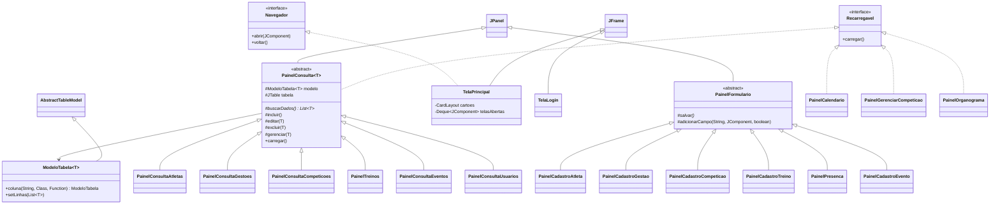

# Diagrama de classes (CH-09)

Dividido em três partes para ficar legível. O GitHub desenha os diagramas automaticamente;
para exportar como imagem, cole o código em <https://mermaid.live> e use **Actions > PNG**.

## 1. Modelo (`br.com.athletiza.model`)

Herança, classes abstratas e as coleções (List, Map, Set) usadas nas associações.

Enums do modelo: `Situacao`, `SituacaoAtleta`, `Genero`, `Perfil`, `TipoAtividade`, `TipoEvento`,
`SituacaoGestao`, `SituacaoCompeticao`, `SituacaoEvento`, `SituacaoTarefa`, `AcaoRegistro`.

## 2. Persistência (`br.com.athletiza.dao`) e exceções

Cada controller (`AtletaController`, `GestaoController`, `CompeticaoController`, `TreinoController`,
`EventoController`, `CalendarioController`, `LoginController`, `UsuarioController`, ...) usa um ou mais DAOs
e o `Validador`, e lança `ValidacaoException` ou `RegraNegocioException`.

## 3. Telas (`br.com.athletiza.view`)

