# Diagramas de sequência (CH-48)

Cada diagrama mostra **View → Controller → DAO → Banco**, com o fluxo principal e o fluxo de erro
(bloco `alt`), como pede o CH-48. São 12 fluxos, para que cada integrante escolha pelo menos 2.

Para exportar como imagem para os slides: cole o código de um diagrama em <https://mermaid.live>
e use **Actions > PNG** (ou SVG).

| # | Fluxo | Telas / classes principais |
|---|---|---|
| 1 | Login | `TelaLogin`, `LoginController`, `UsuarioDAO` |
| 2 | Exibir calendário | `PainelCalendario`, `CalendarioController`, `AtividadeDAO` |
| 3 | Incluir compromisso | `DialogoCompromisso`, `CalendarioController`, `CompromissoDAO` |
| 4 | Cadastrar gestão | `PainelCadastroGestao`, `GestaoController`, `GestaoDAO` |
| 5 | Adicionar membro a um cargo | `PainelGerenciarGestao`, `GestaoController`, `GestaoDAO` |
| 6 | Incluir atleta | `PainelCadastroAtleta`, `AtletaController`, `AtletaDAO` |
| 7 | Excluir atleta com vínculos | `PainelConsultaAtletas`, `AtletaController`, `AtletaDAO` |
| 8 | Gerenciar competição (inscrições) | `PainelGerenciarCompeticao`, `CompeticaoController`, `CompeticaoDAO` |
| 9 | Lançar resultado | `PainelResultados`, `CompeticaoController`, `CompeticaoDAO` |
| 10 | Cadastrar treino (conflito de horário) | `PainelCadastroTreino`, `TreinoController`, `TreinoDAO` |
| 11 | Registrar presença | `PainelPresenca`, `TreinoController`, `TreinoDAO` |
| 12 | Concluir tarefa de evento | `PainelGerenciarEvento`, `EventoController`, `EventoDAO` |

---

## 1. Login

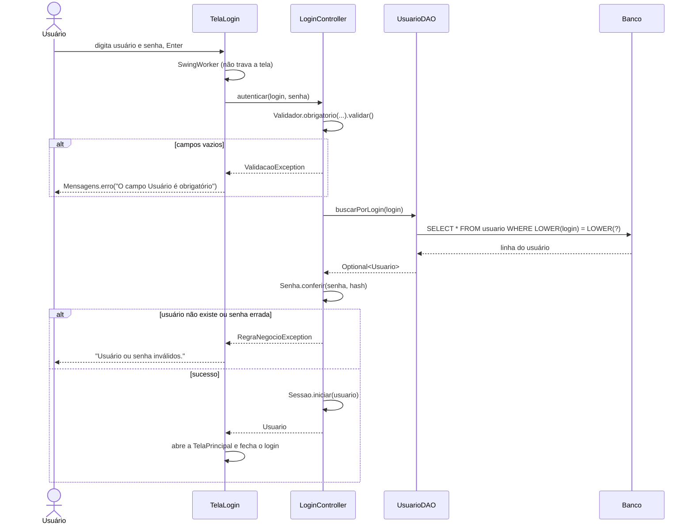

## 2. Exibir calendário

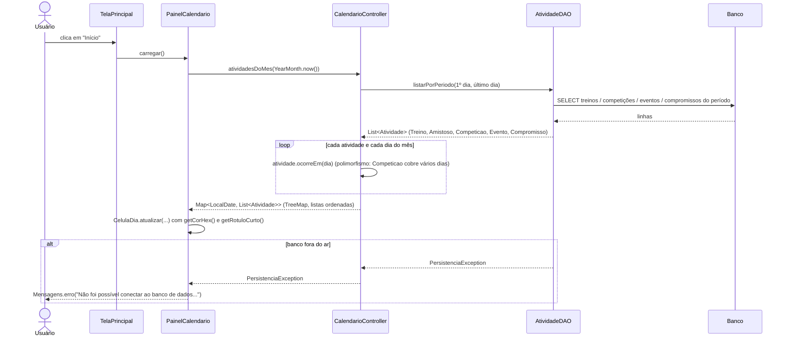

## 3. Incluir compromisso pelo calendário

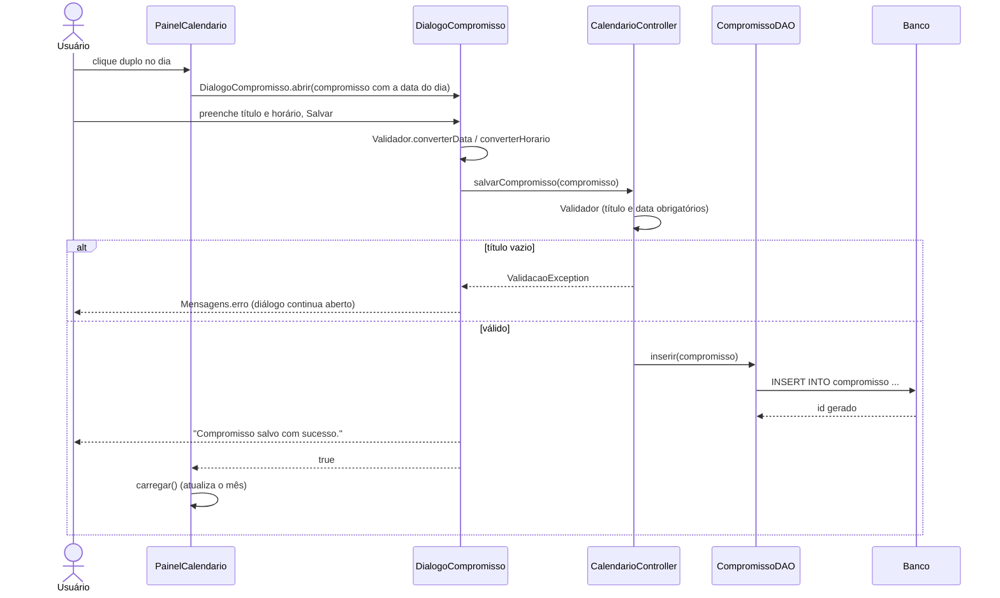

## 4. Cadastrar gestão

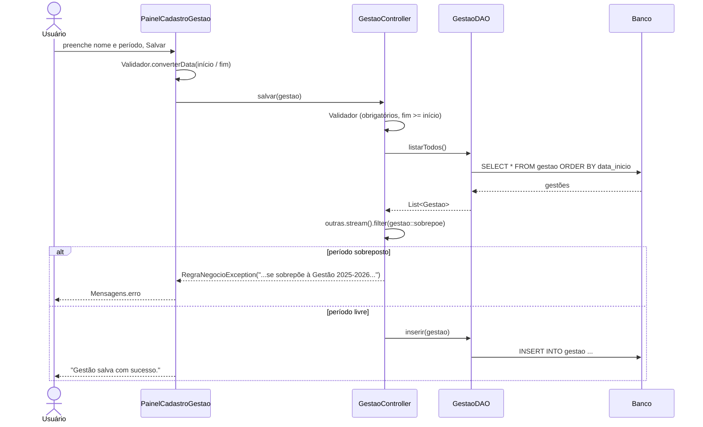

## 5. Adicionar membro a um cargo da gestão

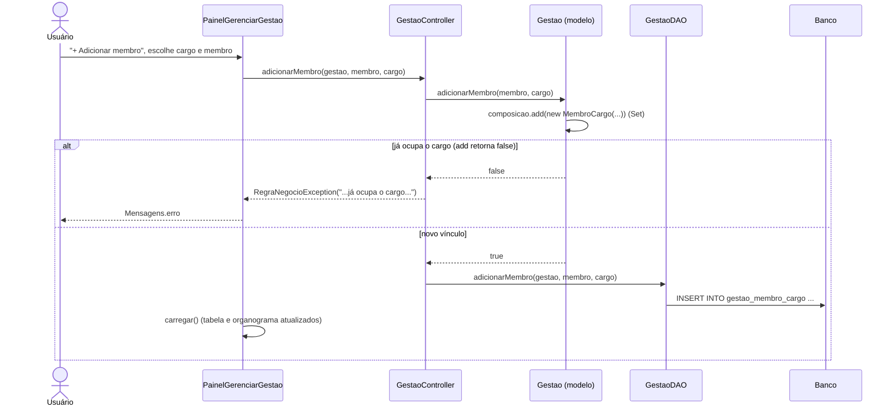

## 6. Incluir atleta

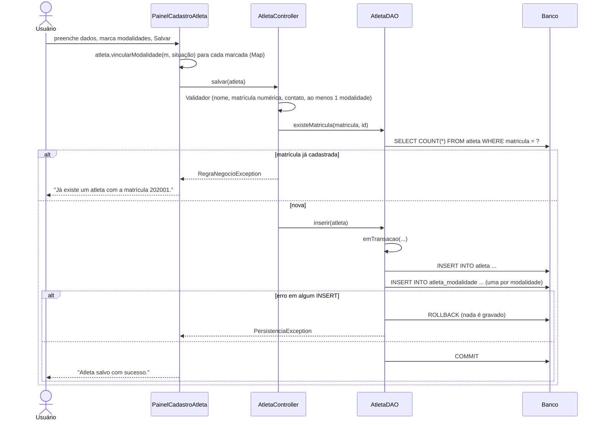

## 7. Excluir atleta com vínculos

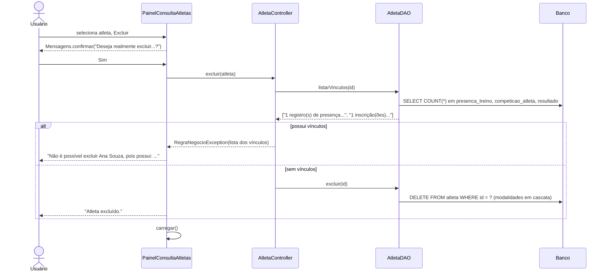

## 8. Gerenciar competição (inscrições)

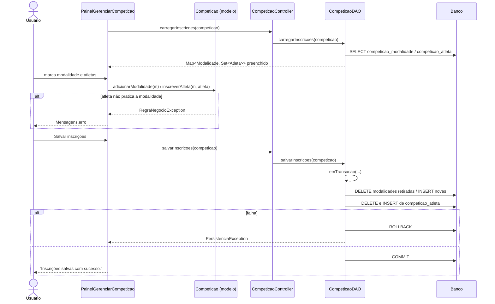

## 9. Lançar resultado de competição

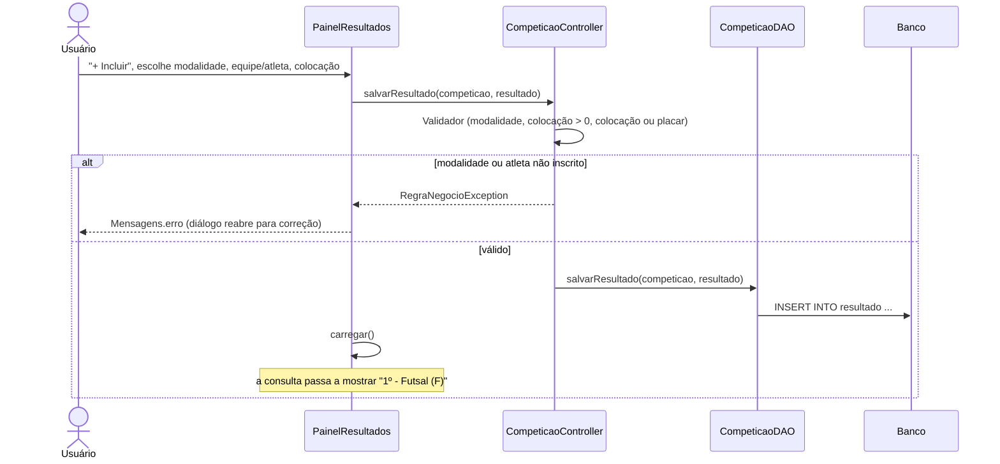

## 10. Cadastrar treino (conflito de horário)

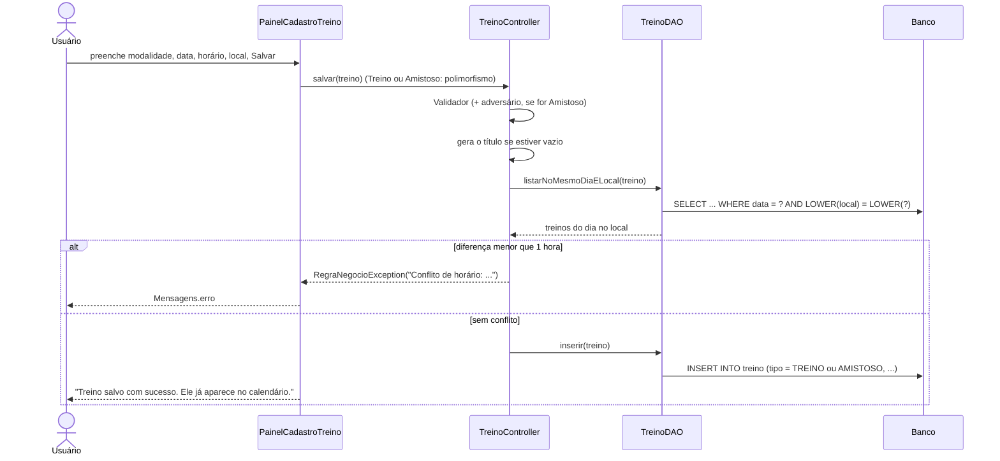

## 11. Registrar presença em treino

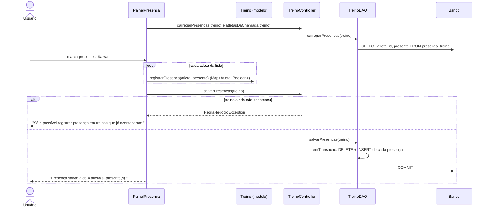

## 12. Concluir tarefa de evento

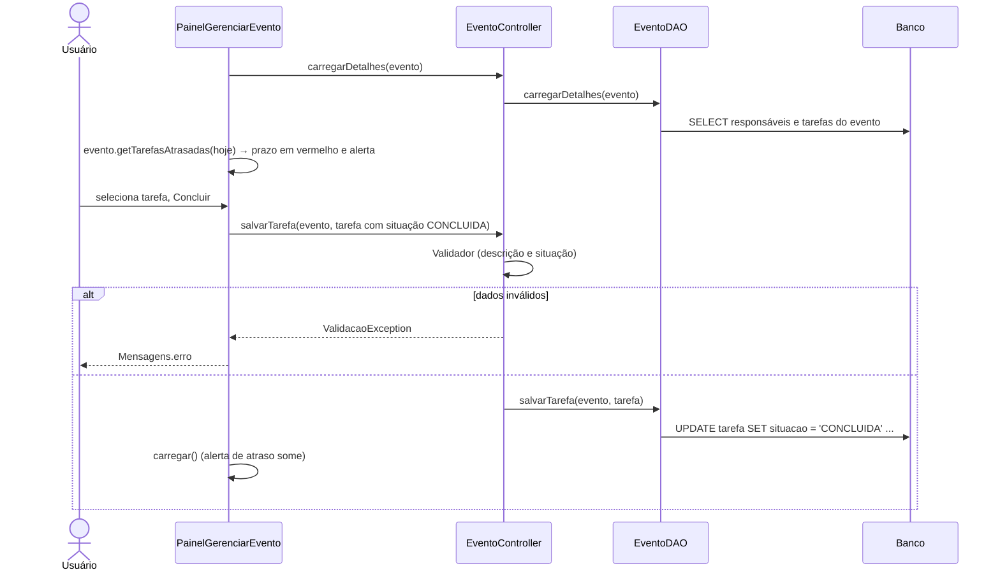
